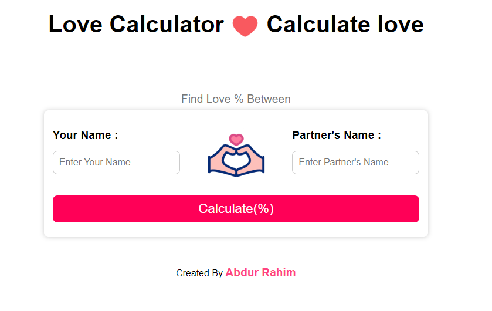
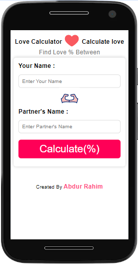

# Love Calculator  

This is a simple love calculator that takes two names as input and returns the percentage of compatibility between them.

## Tools 
- HTML
- CSS
- JavaScript

## Features 
- Responsive
- Simple and easy to use
- Calculates the percentage of compatibility between two names
- Shows a result message based on the calculated score.
- Set URL params both input values.

## Screenshots

## Live Demo
[Love Calculator](https://abdurraahimm.github.io/love-calculator/)

## Getting Started
To get a local copy up and running follow these simple example steps.
- Download the project or
- Clone this repository using terminal or command prompt `https://github.com/AbdurRaahimm/love-calculator.git`
- Change directory to the cloned directory `cd love-calculator`
- Open `index.html` in your preferred browser
- Enjoy!

## Author
👤 Abdur Rahim.
- Github: [@AbdurRahim](https://github.com/AbdurRaahimm)
- Linkedin: [@AbdurRahim](https://www.linkedin.com/in/abdur-rahim4g/)
- Twitter: [@AbdurRahim](https://twitter.com/AbdurRahim4G)

## 🤝 Contributing
Contributions, issues and feature requests are welcome!

